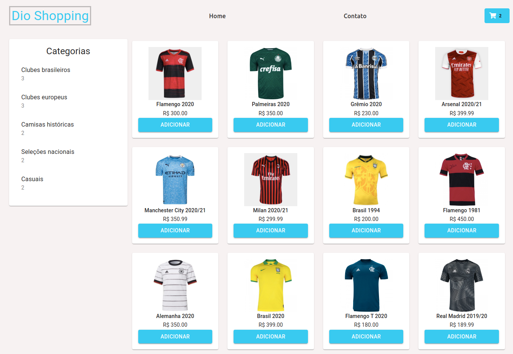

<h1 align="center">
  Dioshopping
</h1>

## 💻 Projeto

O Projeto **Dioshopping** é uma pequena loja de camisas esportivas. Este projeto foi criado com um desafio proposto pelo Bootcamp Inter Frontend Developer.

<h1 align="center">
    
</h1>

<br/>

## 🚀 Tecnologias

- React
- Axios
- React-router
- Material-ui

<br/>

## ℹ️ Como Executar

- ### **Pré-requisitos**

  - É **necessário** possuir o **[Node.js](https://nodejs.org/en/)** instalado no computador
  - Também, é **preciso** ter um gerenciador de pacotes seja o **[NPM](https://www.npmjs.com/)** ou **[Yarn](https://yarnpkg.com/)**.

Executando a Aplicação:

```sh
  # Instalando as dependências do projeto.
  $ yarn install # ou npm install

  # Execute o app
  $ yarn start # ou npm start
```
